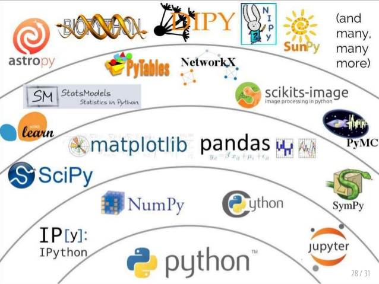

# Curso de Python Científico

__Para ver los notebooks:__ Haga click sobre los notebooks que se encuentran debajo para observarlos en (http://nbviewer.jupyter.org/)

## Temario
* [00. Instalación e Introducción](http://nbviewer.jupyter.org/github/Gerson231294/CursoPython/blob/master/Notebooks/0.%20Instalaci%C3%B3n%20e%20Introducci%C3%B3n.ipynb)
* [01. Python - Sintaxis](http://nbviewer.jupyter.org/github/Gerson231294/CursoPython/blob/master/Notebooks/1.%20Python%20-%20Sintaxis.ipynb)
* [02. Estructuras de control y Bucles](http://nbviewer.jupyter.org/github/Gerson231294/CursoPython/blob/master/Notebooks/2.%20Contro%20de%20Flujo%20y%20Bucles.ipynb)
* [03. Colecciones](http://nbviewer.jupyter.org/github/Gerson231294/CursoPython/blob/master/Notebooks/3.%20Colecciones%20en%20Python.ipynb)
* [04. Funciones](http://nbviewer.jupyter.org/github/Gerson231294/CursoPython/blob/master/Notebooks/4.%20Funciones.ipynb)
* [05. Programación Orientada a Objetos](http://nbviewer.jupyter.org/github/Gerson231294/CursoPython/blob/master/Notebooks/5.%20Programacion%20orientada%20a%20objetos.ipynb)
* [06. Archivos & Manejo de Excepciones](http://nbviewer.jupyter.org/github/Gerson231294/CursoPython/blob/master/Notebooks/6.%20Archivos%2C%20Manejo%20de%20Errores%20%26%20Excepciones.ipynb)
* [07. Numpy](http://nbviewer.jupyter.org/github/Gerson231294/CursoPython/blob/master/Notebooks/7.%20Numpy%20-%20Introducci%C3%B3n.ipynb)
* [08. Matplotlib](http://nbviewer.jupyter.org/github/Gerson231294/CursoPython/blob/master/Notebooks/8.%20Matplotlib.ipynb)
* [09. Sympy](http://nbviewer.jupyter.org/github/Gerson231294/CursoPython/blob/master/Notebooks/9.%20Sympy.ipynb)
* [10. Pandas](http://nbviewer.jupyter.org/github/Gerson231294/CursoPython/blob/master/Notebooks/10.%20Pandas.ipynb)
* [11. Scipy](http://nbviewer.jupyter.org/github/Gerson231294/CursoPython/blob/master/Notebooks/11.%20Scipy.ipynb)
* [12. Scikit-Learn](http://nbviewer.jupyter.org/github/Gerson231294/CursoPython/blob/master/Notebooks/12.%20Scikit-Learn.ipynb)

## Lista de librerías usadas en el curso:

* [NumPy](http://www.numpy.org/), es la biblioteca natural para  python numérico. La característica más potente de NumPy es la  matriz n-dimensional. Esta biblioteca  contiene funciones básicas de álgebra lineal, transformadas de Fourier, capacidades avanzadas de números aleatorios y herramientas para la integración con otros lenguajes de bajo nivel como Fortran, C y C ++.

* [SciPy](https://www.scipy.org/) es la biblioeteca para python científico. SciPy se basa en NumPy y es una de las bibliotecas más útiles por la variedad de módulos de ciencia y ingeniería de alto nivel con la que cuenta, como la transformada discreta de Fourier,  álgebra lineal, optimización,  matrices dispersas, etc.

* [Pandas](http://pandas.pydata.org/) es una librería  para operaciones y manipulaciones de datos estructurados. Pandas ha sido añadido  recientemente a Python y han sido fundamental para impulsar el uso de Python en la ciencia de datos.

* [Matplotlib](http://matplotlib.org/) es una librería de Python  para  crear una gran variedad de gráficos, a partir de histogramas, lineas, etc, usando si es necesario  comandos de látex para agregar matemáticas a los gráficos.

* [Seaborn](https://seaborn.pydata.org/) es una libreria para la visualización de datos estadísticos. Seaborn es una biblioteca para hacer atractivos e informativos los gráficos estadísticos en Python. Se basa en matplotlib. Seaborn pretende hacer de la visualización una parte central de la exploración y la comprensión de los datos.

* [SymPy](https://simpy.readthedocs.io/en/latest/) es una biblioteca  para la computación simbólica. Tiene amplias capacidades desde la aritmética simbólica básica hasta el cálculo, el álgebra, la matemática discreta y la física cuántica. Otra característica útil es la capacidad de formatear el resultado de los cálculos como código LaTeX.

* [Scikit-learn](http://scikit-learn.org/stable/), es tal vez la mejor biblioteca para Machine Learning, construida sobre NumPy, SciPy y Matplotlib, esta biblioteca contiene una gran cantidad de herramientas eficientes para el Machine Learning y el modelado estadístico incluyendo clasificación, regresión, agrupación y reducción de la dimensionalidad.

## Autor
* [@gersongams](https://github.com/gersongams)

## Referencias

- Sweigart, A. (2015). Automate the Boring Stuff with Python: Practical Programming for Total Beginners. No Starch Press.
- Matthes, E. (2015). Python Crash Course: A Hands-on, Project-based Introduction to Programming. No Starch Press.
- https://github.com/Kyubyong/numpy_exercises
- http://www.labri.fr/perso/nrougier/teaching/numpy/numpy.html
- https://github.com/jrjohansson/scientific-python-lectures
- https://stanford.edu/~arbenson/cme193.html